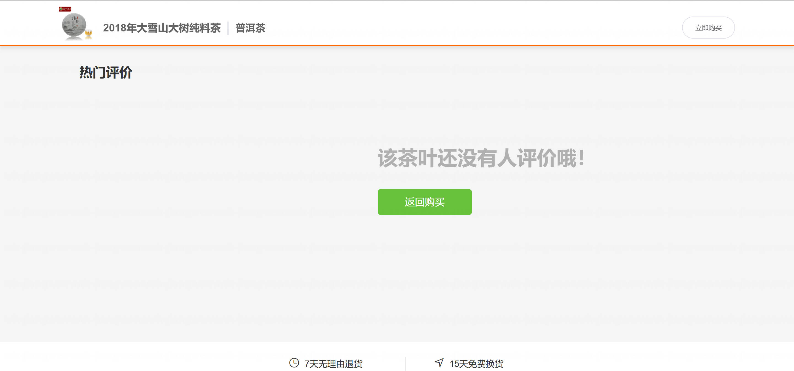

基于 Spring Boot 的茶叶商城系统
=

### 完整代码获取地址：从戎源码网 ([https://armycodes.com/](https://armycodes.com/))
### 作者微信：19941326836  QQ：952045282 
### 承接计算机毕业设计、Java毕业设计、Python毕业设计、深度学习、机器学习
### 选题+开题报告+任务书+程序定制+安装调试+论文+答辩ppt 一条龙服务
### 所有选题地址https://github.com/nature924/allProject

一、项目介绍
---

基于 Spring Boot 的茶叶商城系统，系统角色为管理员与顾客（含 VIP 管理模块），主要功能如下

管理员：
基本操作：登录、修改密码、获取个人信息、修改个人信息
用户与权限管理：筛选用户、查看/删除用户详情、授权用户、用户状态管理、角色管理（新增/修改/删除/查询/权限查看）、用户-角色关联管理
商品与规格管理：分类/规格管理、查看分类与规格、商品管理（新增/修改/删除/查询）、商品与规格关联管理、批量添加规格项
商品评价管理：新增/修改/删除/查询商品评价
购物与订单管理：查看订单详情、订单明细管理、订单相关统计（含退货/退款处理接口）
购物车管理：查询购物车、添加/更新/删除购物车项、按用户清空购物车
售后与退货管理：退货原因管理（增删改查）、退货申请处理（新增/更新/拒绝/退款/收货/发回等流程）、退货记录查询与统计
物流管理：添加/删除物流信息、查询物流信息
采购与供应链管理：供应商管理（增删改查/可用查询）、采购单管理（增删改查/收货/列表查询/统计）
VIP/会员管理：VIP 信息增删改查、会员查询与校验

顾客（普通用户）：
基本操作：注册、登录、修改密码、获取/修改个人信息
商品浏览：商品分类浏览、首页并行加载分类与商品列表、商品详情查看、规格选择
购物流程：加入购物车、购物车查看与编辑、下单（生成订单）、查看订单明细
评价与售后：提交商品评价、申请退货/查看退货进度
VIP 功能：查看/申请 VIP（会员）相关信息

二、项目技术
---
- 编程语言：Java
- 数据库：MySQL
- 项目管理工具：Maven
- 前端技术：VUE、HTML、Jquery、Bootstrap
- 后端技术：Spring、SpringMVC、MyBatis

三、运行环境
---
- 操作系统：Windows、macOS都可以
- JDK版本：JDK1.8以上都可以
- 开发工具：IDEA、Ecplise、Myecplise都可以
- 数据库: MySQL5.7以上都可以
- Tomcat：任意版本都可以
- Maven：任意版本都可以

四、运行截图
---

### 程序截图：

